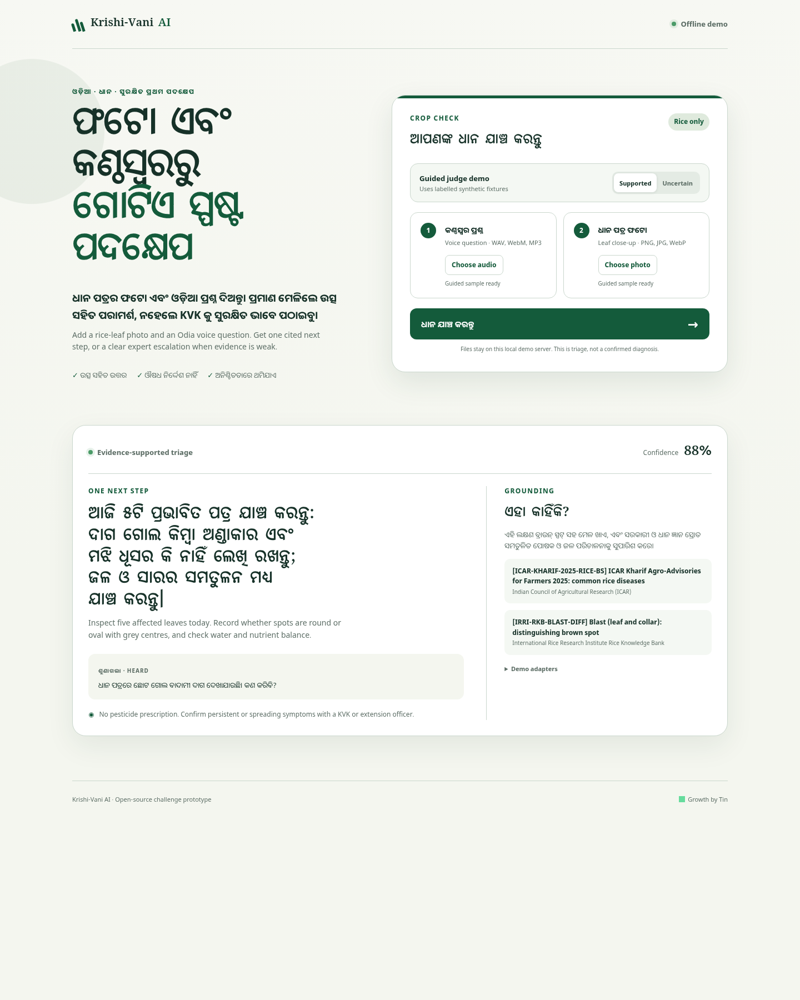

# Krishi-Vani AI

Krishi-Vani AI is a narrow, offline-capable challenge prototype for an Odia-speaking rice farmer. It accepts a voice file and rice-leaf image, then returns either one cited, non-chemical next step or a clear KVK/extension escalation.



## Run in one command

Python 3.11+ is the only requirement.

```bash
./demo.sh
```

Open [http://127.0.0.1:8787](http://127.0.0.1:8787). The guided demo starts with the supported fixture. Switch to **Uncertain** to show the abstention path.

Run all checks with:

```bash
make check
```

## What is real, and what is simulated

The demo is intentionally explicit about its boundaries:

| Part | Demo status | Production path |
|---|---|---|
| Audio and image upload | Real local browser-to-server transport | Same contract can accept mobile/WhatsApp media later |
| Odia speech recognition | Deterministic SHA-matched fixture adapter | AI4Bharat/Bhashini adapter is not connected or claimed |
| Rice image triage | Deterministic SHA-matched fixture adapter | AIKosh-trained vision adapter is not connected or claimed |
| Retrieval and citations | Real retrieval from a small curated ICAR/IRRI knowledge file | Replace with a licensed, versioned Odia corpus |
| Response generation | Deterministic grounded adapter by default | Optional local Llama 3 through Ollama is fully implemented |
| Safety | Real confidence threshold, citation validation, chemical-prescription guard and KVK escalation | Extend with agronomist-reviewed policies and monitoring |

The included SVGs are labelled synthetic illustrations, not AIKosh images. The WAVs are deterministic audio transport fixtures, not recordings or synthetic speech. This keeps the repository reproducible without misrepresenting unavailable datasets or model access.

## Use local Llama 3

Install [Ollama](https://ollama.com/), make a Llama 3-family model available locally, then run:

```bash
OLLAMA_MODEL=llama3.1:8b KRISHI_LLM_MODE=ollama ./demo.sh
```

The model receives the Odia transcript, vision cues, and retrieved evidence. It must return strict bilingual JSON with known citation IDs and exactly one non-chemical next step. Unknown citations, unsafe advice, invalid JSON, or a local model failure trigger the validated deterministic fallback. No paid API or cloud credential is required.

## Safety boundary

- This is triage, not a confirmed diagnosis.
- The demo never prescribes pesticides, fungicides, products, or doses.
- Confidence below `0.72` abstains and sends the farmer to a KVK or agricultural extension officer.
- A supported answer includes citation IDs that must match retrieved evidence.
- Unknown uploads fail closed in offline mode.

See [the architecture](docs/ARCHITECTURE.md), [data and model notes](docs/DATA_AND_MODEL_NOTES.md), and [the 5–7 minute judge walkthrough](docs/JUDGE_WALKTHROUGH.md).

## Repository map

```text
app/                  Odia-first accessible web workbench
krishi_vani/          HTTP server, adapters, retrieval, grounding and safety
data/knowledge.json   Curated cited demonstration evidence
fixtures/             Labelled supported and uncertain fixtures
scripts/              Reproducible fixture generation
tests/                Input, grounding, citation, safety and API checks
docs/                 Architecture, limitations and walkthrough
```

## License

Code is licensed under the [MIT License](LICENSE). Bundled Noto Oriya fonts use the [SIL Open Font License](app/fonts/OFL.txt). The repository does not redistribute AIKosh, AI4Bharat, ICAR, or IRRI datasets. Linked third-party source material remains under its publisher's terms.
